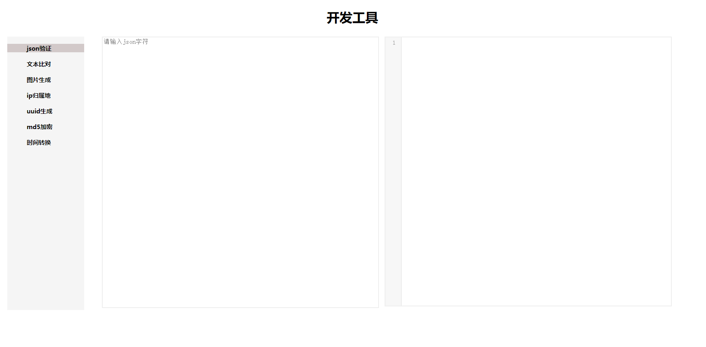

### 开发工具箱
平时开发比较常用的一些工具

### 部署
修改index.html网页server_url为你自己的服务地址；然后运行Application.java，成功后在浏览器输入`http://ip:port`即可访问
### 鸣谢
https://github.com/lionsoul2014/ip2region

https://github.com/dromara/hutool

https://github.com/leezng/vue-json-pretty

